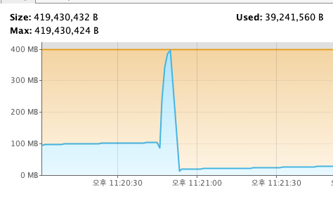
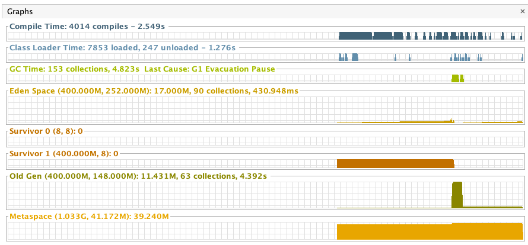
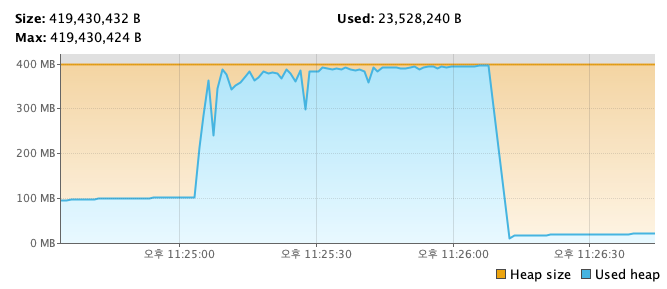
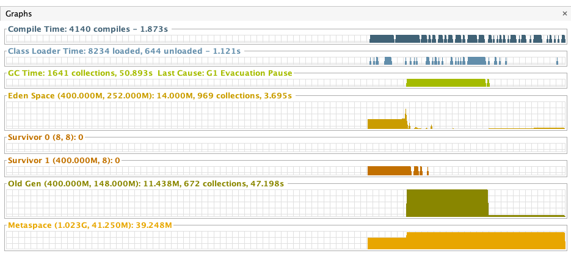
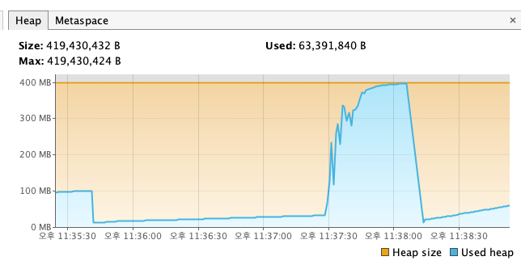
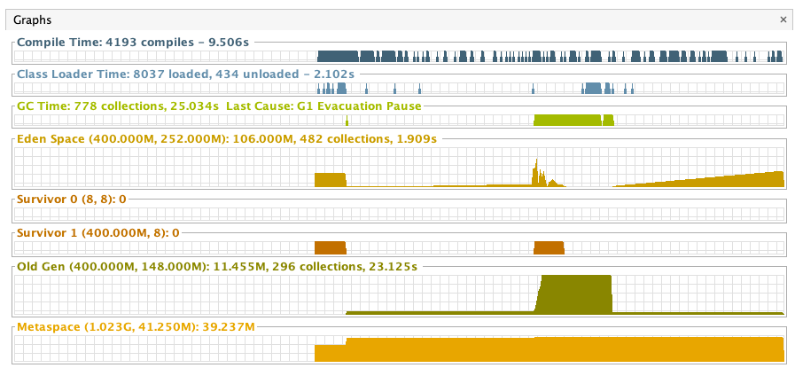

## oom-reference
* OOM 을 발생시키고, 힙덤프 분석.
* gradle application plugins 를 이용
* StrongReference vs SoftReference vs WeakReference 비교

## strong reference 지표

## soft reference 지표

## weak reference 지표

## reference
* [gradle application plugins](https://docs.gradle.org/current/userguide/application_plugin.html)

